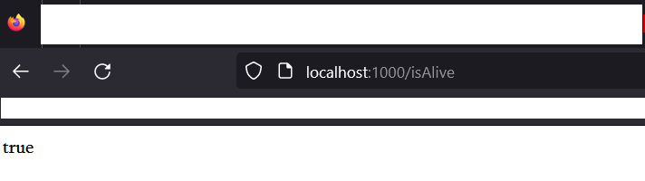
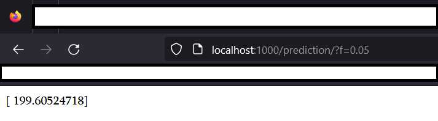

### Now let's build actual image and deploy it.

```console
docker build -t model .
```
In the order to launc the image we need to run this command
```console
docker run -p 1000:80 model
```

To check if it is running we as intended, open the web browser and type:
```console
http://localhost:1000/isAlive
```
After becoming sure everything is up and running,



we can pass the arguments and calculate the arguments
```console
http://localhost:1000/prediction/?f=0.05
```
this will return the prediction



The end :)